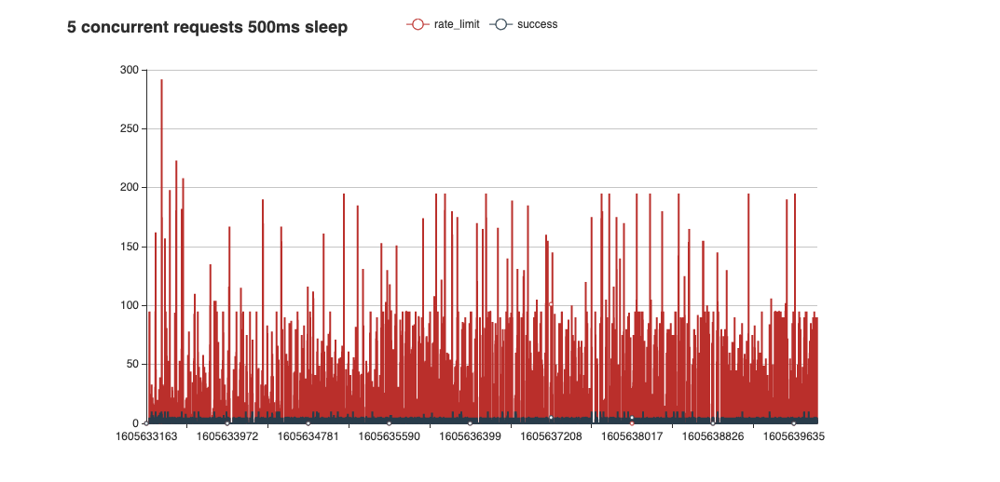

# pubsub-push-window

Google Cloud Pub/Sub offers [push subscriptions][]. With push subscriptions,
Google controls the delivery rate of messages as described [here][delivery-rate].
My goal is to understand the implications of these semantics in rate-limited environments.

#### Does the Pub/Sub push window converge on a concurrent request limit?
It appears not. Over the course of hours, Pub/Sub continues to send hundreds
of requests per second, even though only a small fraction of those are
successful.

#### Do 429 responses count against [dead letter][] delivery attempts?
[From Google] All 4XX and 5XX codes are treated as a negative acknowledgement
and are treated the same way. The retry behavior is influenced by the number
of negative acknowledgements, as opposed to the response code provided with it.

[push subscriptions]: https://cloud.google.com/pubsub/docs/push
[delivery-rate]: https://cloud.google.com/pubsub/docs/push#quotas_limits_and_delivery_rate
[dead letter]: https://cloud.google.com/pubsub/docs/dead-letter-topics
